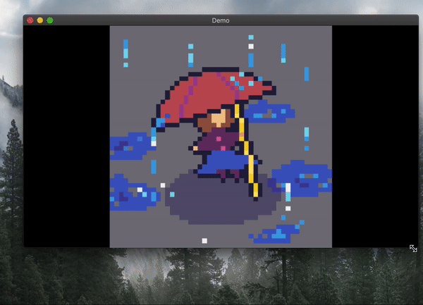

The purpose of this library is to make drawing games with resizable windows easier, especially pixel art games.



_note: the stretching of the image is due to Love2D, may vary between platforms and versions._


Include it with:  

```lua
import('path/to/window')
```

## Load

```lua
function window.setup(resx, resy, sizex, sizey, [table], [background_color], [draw_to_background])
```
This function sets it all up. It creates a new canvas (the "virtual" canvas) which your game will be rendered on.

__resx__: the x resolution of the virtual canvas  
__resy__: the y resolution of the virtual canvas  
__sizex__: the x dimension of the window in real pixels  
__sizey__: the y dimension of the window in real pixels  

__table__: This is the table passed into `love.graphics.setMode(x, y, {this table here})` see [the wiki](https://love2d.org/wiki/love.window.setMode).  
__background_color__: the color of the borders  
__draw_to_background__: a function to be called on the background, behind the virtual canvas

## Update
No updating necessary! The math is pretty simple and is done during the draw process. 


## Draw

```lua
window.start_draw()
```
Call this function before drawing anything, it will setup the draw process.
```lua
window.end_draw()
```
Call this function after you have drawn your game.


## Mouse
```lua
window.mouse_x()
```

```lua
window.mouse_y()
```

Calling the usual `love.mouse.getX()`, `love.mouse.getY()` and `love.mouse.getPosition()` will return the x and y position of the mouse over the main canvas, `window.mouse_x()` and `window.mouse_y` will return the x and y position of the pixel under the mouse on the virtual canvas.

